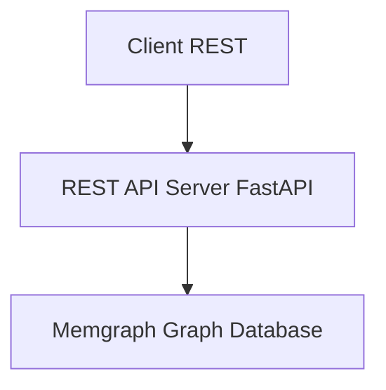

# REST to Memgraph Adapter - System Design (Python/FastAPI)

## Goal

Expose a RESTful API that directly queries a Memgraph graph database, so clients can access data using traditional REST endpoints.

---

## High-Level Architecture



---

##  Components
The system is decomposed into focused layers so query logic, transport, and infrastructure concerns remain isolated and testable.

### REST API Layer (FastAPI)
- Defines and documents REST endpoints (e.g. `/subject/by/{field}/count`) with automatic OpenAPI schema.
- Handles HTTP concerns: routing, parsing, status codes, paging, filtering.
- Uses Pydantic models for request/response validation and serialization.
- **Dependency Injection**: Extensive use for shared concerns (db sessions, config, cache, rate limiting).
- Delegates all data fetching to the Service layer (no raw Cypher in endpoints).

### Service Layer
- Orchestrates one or more repository (data access) calls
- Implements domain logic / aggregations / post-processing  
- Converts lower‑level data structures into response DTOs
- **Caching Integration**: Services handle caching logic with configurable TTLs

### Data Access Layer (Memgraph Repository)
- Encapsulates Cypher queries & parameter binding via the Neo4j Python driver (Memgraph-compatible).
- Provides reusable functions: `get_subject_counts_by(field)`, etc.
- Central place to optimize queries / add caching hints.
- **Query Safety**: All queries use parameterized Cypher to prevent injection

### Memgraph Graph Database
- Stores domain entities as nodes & relationships (e.g. `(:Sample)`)
- Queried via Cypher over Bolt protocol
- **Connection Management**: Async driver with connection pooling and lifecycle management

### Caching Layer
- **Redis**: Async Redis client with connection health checks
- **Key Strategy**: Namespaced keys `entity:operation:hash` with configurable TTL
- **Graceful Degradation**: System continues working when Redis is unavailable

### Validation & Security
- **Input Validation**: Pydantic schemas (FastAPI request models) and custom validators
- **Rate Limiting**: Built into FastAPI dependencies system  
- **CORS**: Configurable via `CORSMiddleware`
- **Error Handling**: Custom exception classes with consistent JSON responses

### Observability
- **Structured Logging**: Configurable JSON/text format with request correlation
- **Health Checks**: Basic health and root endpoints implemented
- **Configuration**: Environment-based settings with validation

### Configuration & Secrets
- **Centralized Config**: `pydantic-settings` with nested configuration objects
- **Environment Support**: Supports dev, test, prod configurations via environment variables  
- **Validation**: Schema validation for all configuration values

### Error Handling
- Normalizes errors to a consistent JSON envelope.
- FastAPI exception handlers map domain exceptions (validation, unsupported field, Cypher failure) to proper HTTP codes.

---

## Tech Stack

| Layer | Technology | Purpose |
|-------|------------|---------|
| Runtime | Python 3.10+ | Server-side logic |
| Web Framework | FastAPI + Uvicorn | RESTful routing, async I/O, auto OpenAPI |
| Graph Database Client | `neo4j` Python driver (Memgraph-compatible) | Bolt connectivity & Cypher execution |
| Configuration | `pydantic-settings` | Comprehensive configuration management |
| Input Validation | Pydantic (FastAPI models) | Validate and serialize requests/responses |
| Caching | `redis.asyncio` | Async Redis cache for query results |
| Logging | Structured logging with custom config | Structured app and HTTP logs |
| Error Handling | Custom exception classes + FastAPI handlers | Consistent JSON error responses |
| Dependencies | FastAPI dependency injection | Shared concerns (db, cache, auth, pagination) |
| Rate Limiting | Built into dependencies | Request throttling protection |
| Documentation | FastAPI auto docs (Swagger UI/Redoc) | REST endpoint docs (OpenAPI) |
| Security | CORS, GZip middlewares | Headers, CORS & performance |
| Testing | pytest + httpx | Unit & integration test framework |
| Containerization | Docker + docker-compose | Deployment packaging |
| Code Quality | TBD (ruff, black, isort, mypy) | Linting & type checking |

---

## API Surface (Derived from `swagger.yml`)

The OpenAPI spec (`swagger.yml`) defines the contract. Core resource groups:

### Core Endpoints

| Group | Endpoints (GET) | Purpose |
|-------|------------------|---------|
| Subject | `/subject`, `/subject/{organization}/{namespace}/{name}`, `/subject/by/{field}/count`, `/subject/summary` | Line-level subject data, retrieval by ID, grouped counts & summary |
| Sample | `/sample`, `/sample/{organization}/{namespace}/{name}`, `/sample/by/{field}/count`, `/sample/summary` | Line-level sample data, retrieval by ID, grouped counts & summary |
| File | `/file`, `/file/{organization}/{namespace}/{name}`, `/file/by/{field}/count`, `/file/summary` | Line-level file metadata & aggregations |
| Metadata Fields | `/metadata/fields/subject`, `/metadata/fields/sample`, `/metadata/fields/file` | Discover supported filterable fields per entity |
| Namespace | `/namespace`, `/namespace/{organization}/{namespace}` | Namespace registry |

### Diagnosis Endpoints

| Entity | Diagnosis Endpoints | Purpose |
|--------|-------------------|---------|
| Subject | `/subject/diagnosis/search`, `/subject/diagnosis/by/{field}/count`, `/subject/diagnosis/summary` | Subject diagnosis search with case-insensitive substring matching |
| Sample | `/sample/diagnosis/search`, `/sample/diagnosis/by/{field}/count`, `/sample/diagnosis/summary` | Sample diagnosis search with case-insensitive substring matching |

### Additional Endpoints

| Group | Endpoints (GET) | Purpose |
|-------|------------------|---------|
| Organization | `/organization`, `/organization/{name}` | Organization registry |
| Info | `/info` | Server info (version, etc.) |
| Standalone Diagnosis | `/sample-diagnosis`, `/subject-diagnosis` | Free‑text diagnosis search extensions |

Cross-cutting behaviors:
1. Pagination & Link headers for list endpoints.
2. Filtering on harmonized & unharmonized fields (`metadata.unharmonized.*`).
3. Grouped counts by arbitrary supported field (`/by/{field}/count`).
4. Summaries returning aggregated metrics (`/summary`).
5. Consistent error envelope (`responses.Errors`).

---

##  Filtering Model

List endpoints support exact-match filtering (case-sensitive) across harmonized and unharmonized fields, multi-value fields apply OR semantics within the field, experimental diagnosis endpoints apply case-insensitive substring matching, and an allowlist prevents unsupported field usage.

---

## `/by/{field}/count` Endpoints

Count endpoints group entities by a validated field and return frequency distributions, excluding null or empty values, and respond with 400 for unsupported fields.

---

## Pagination & Link Headers

Parameters: `page` (1-based, default 1), `per_page` (default 100 unless overridden via config).

Offset calculation: `offset = (page - 1) * per_page`. Guard: if page < 1 or per_page < 1 → 400 `InvalidParameters`.

Total counting strategies:
1. Standard: `MATCH (n:Entity {filters}) RETURN count(n)` (may be expensive; optionally restrict to `LIMIT (page * per_page + 1)` to infer `next`).
2. Optimization: maintain approximate counts via periodic job (future).

Link header construction (RFC 5988 style):
```
<base?page=1&per_page=100>; rel="first", <base?page=last&per_page=100>; rel="last", <base?page=prev>; rel="prev", <base?page=next>; rel="next"
```
Include only relations applicable per spec requirements.

---

## Error Handling Strategy

Error envelope (implemented in `models/errors.py`):
```json
{ 
  "errors": [ 
    { 
      "kind": "InvalidParameters", 
      "parameters": ["page"], 
      "reason": "...", 
      "message": "...",
      "field": "...",
      "entity": "..."
    } 
  ] 
}
```

**Error Mappings:**
| Condition | HTTP Status | Error Kind |
|-----------|-------------|------------|
| Unknown field (count) | 400 | `UnsupportedField` |
| Invalid `page` / `per_page` | 400 | `InvalidParameters` |
| Entity not found by ID | 404 | `NotFound` |
| Data cannot be shared (config) | 404 | `UnshareableData` |
| Internal exception | 500 | `InternalServerError` |

**Error Handling Features:**
- Custom exception classes inheriting from `CCDIException`
- Automatic conversion to FastAPI `HTTPException`
- Consistent error envelope format per OpenAPI spec
- Structured logging for all errors
- Utility functions for common error scenarios
- Proper HTTP status code mapping

---

## Summary & Aggregation Endpoints (`/summary`)

Each entity summary aggregates selected metrics (defined in `models/dto.py`). 

**Implementation approach:**
- **Real-time aggregation**: Multiple Cypher subqueries combined using UNION or individual queries
- **Caching**: Results cached with configurable TTL (15 minutes default)
- **Error handling**: Graceful fallback and consistent error responses
- **Future optimization**: Precomputed aggregates using scheduled job writing back to graph nodes

**Coverage:**
- Subject summaries implemented in `services/subject.py`
- Sample summaries implemented in `services/sample.py` 
- File summaries implemented in `services/file.py`
- Caching integrated for performance

---

## Testing Approach (Spec Alignment)

Test layers:
1. Unit: predicate builder → given filters produce expected Cypher & params (pytest).
2. Integration (Memgraph test container): seed minimal graph, exercise endpoints verifying status codes, pagination, Link headers, error kinds (pytest + httpx client).
3. Contract: validate `swagger.yml` & generated OpenAPI (FastAPI) using `schemathesis` or `openapi-core` to ensure responses conform.

---

## Security & Hardening (Spec-Relevant)
* Rate limiting on high-cardinality endpoints `/subject` & `/sample` via `slowapi`.
* Field allowlist eliminates Cypher injection surface.
* Strict JSON parsing & size limits (FastAPI validation, body size limit via ASGI server or middleware).
* CORS restricted by configuration (allowed origins list via `CORSMiddleware`).

---

## Caching Policy

| Endpoint Type | Cache Scope | TTL |
|---------------|-------------|-----|
| `/by/{field}/count` | key per entity+field+filter-hash | 30 min (1800s) |
| `/summary` | single key per entity | 15 min (900s) |
| List pages | LRU cache for filtered results | 5 min (300s) |
| Individual entity retrieval | Optional per-entity caching | Configurable |

**Cache Configuration (from `core/config.py`):**
- `cache_ttl_count_endpoints: 1800` (30 minutes)  
- `cache_ttl_summary_endpoints: 900` (15 minutes)
- `cache_ttl_list_endpoints: 300` (5 minutes)
- Redis connection with health checks and retry logic
- Graceful fallback when Redis is unavailable

**Cache Implementation Features:**
- Async Redis client with connection pooling
- JSON serialization with fallback handling
- Pattern-based cache clearing 
- Health checks and error handling
- Configurable TTL per endpoint type

---

## Folder Structure

```
project-root/
├── pyproject.toml                      # Poetry metadata and dependencies
├── requirements.txt                    # Pip requirements file
├── swagger.yml                         # OpenAPI specification
├── docker-compose.yml                  # Docker composition for dev/test
├── Dockerfile                          # Container image definition
├── app/
│   ├── main.py                         # FastAPI app factory, middleware, routes mount
│   ├── api/
│   │   ├── v1/
│   │   │   ├── __init__.py
│   │   │   ├── deps.py                 # Common dependencies (db, cache, settings, rate limiting)
│   │   │   ├── endpoints/              # REST endpoints
│   │   │   │   ├── subjects.py         # Subject endpoints (including diagnosis search)
│   │   │   │   ├── samples.py          # Sample endpoints (including diagnosis search)
│   │   │   │   ├── files.py            # File endpoints
│   │   │   │   ├── metadata.py         # Metadata field discovery endpoints
│   │   │   │   ├── namespaces.py       # Namespace registry endpoints
│   │   │   │   ├── organizations.py    # Organization registry endpoints
│   │   │   │   └── info.py             # Server info endpoint
│   │   │   └── routes/                 # Route organization
│   │   │       └── __init__.py
│   ├── services/                       # Business logic layer
│   │   ├── subject.py                  # Subject business logic
│   │   ├── sample.py                   # Sample business logic
│   │   ├── file.py                     # File business logic
│   │   ├── organization.py             # Organization business logic
│   │   ├── info.py                     # Info service
│   │   └── diagnosis.py                # Standalone diagnosis service (optional)
│   ├── repositories/                   # Data access layer  
│   │   ├── subject.py                  # Subject data access
│   │   ├── sample.py                   # Sample data access
│   │   ├── file.py                     # File data access
│   │   ├── organization.py             # Organization data access
│   │   ├── info.py                     # Info repository 
│   │   └── diagnosis.py                # Standalone diagnosis data access (optional)
│   ├── db/
│   │   └── memgraph.py                 # Neo4j driver init (Memgraph)
│   ├── models/
│   │   ├── dto.py                      # Pydantic response/request models
│   │   └── errors.py                   # Error envelopes & exception classes
│   ├── core/
│   │   ├── config.py                   # Settings (pydantic-settings)
│   │   ├── logging.py                  # Structured logging config
│   │   ├── pagination.py               # Common pagination utils & Link builders
│   │   └── cache.py                    # Redis cache service
│   ├── lib/
│   │   └── field_allowlist.py          # Loads allowable filter/aggregation fields
│   └── cache/                          # Legacy folder (functionality moved to core/cache.py)
├── tests/
│   ├── __init__.py
│   ├── unit/                           # Unit test structure
│   └── integration/                    # Integration test structure  
├── scripts/                            # Utility scripts
└── docker/                             # Docker-related configuration files
```

Notes:
- Each repository exposes only pure data access functions returning plain objects.
- Services layer composes repositories, applies business logic & caching.
- Route modules stay thin: validation → service call → response mapping (Pydantic models).
- `field_allowlist.py` hydrated at startup (from metadata repository or static file) to validate `/by/{field}/count` and filter params.
- Experimental endpoints placed with explicit naming to allow easy isolation or removal.

---

<!-- REST to Cypher Mapping section intentionally removed (implementation detail not required) -->

---

<!-- Sample route implementation removed (implementation detail not required) -->

---

<!-- App entry point implementation removed (implementation detail not required) -->

---

<!-- Example response removed (implementation detail not required) -->

---

## Summary

**System Overview:**

Input filters safely translated into parameterized Cypher queries
Pagination & Link headers conforming to specification
Consistent error envelope per OpenAPI components schema
Comprehensive caching with Redis and configurable TTLs
Rate limiting and security middleware
Structured logging and configuration management
Diagnosis search functionality integrated into Subject and Sample endpoints
Health and root endpoints (`/health`, `/`)
Test structure in place

**Architecture Benefits:**
- Extensible layering (endpoints → services → repositories) supports new features with minimal duplication
- FastAPI dependency injection provides clean separation of concerns
- Comprehensive error handling with proper HTTP status codes
- Production-ready caching and performance optimizations
- Structured configuration supporting multiple deployment environments

