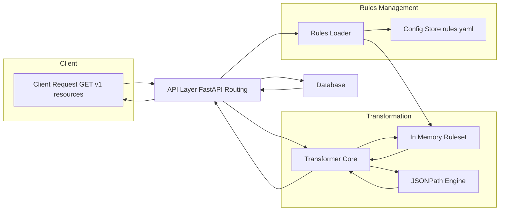
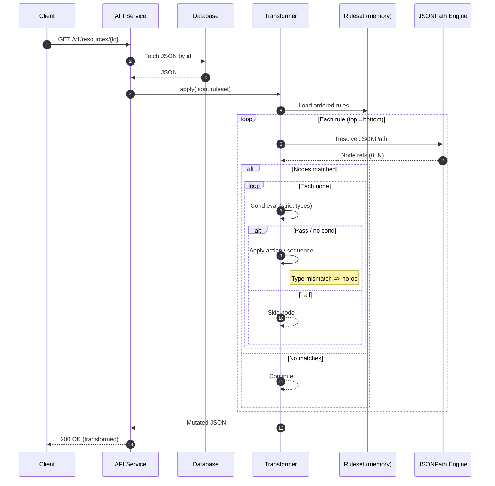

# On-the-Fly JSON Transformation Service — System Design

## Overview
A stateless API that fetches JSON from a database and applies value-level transformations defined in a **YAML rules file**. Targets nested fields via **JSONPath**, applies **all matching rules in sequence**, uses **strict typing** (no coercion), and treats **missing paths as no-ops**.

---

## Architecture

- **API Service**
  - HTTP handling, input parsing, DB query, pagination.
  - Calls Transformer with the fetched JSON and in-memory ruleset.
- **Transformer Library (Core)**
  - JSONPath targeting, condition evaluation, actions executor.
  - In-place mutation of matched nodes; strict typing; compose-all.
- **Rules Loader**
  - Loads `rules.yaml` at startup; protected hot-reload endpoint optional.
  - Validates YAML against a small JSON Schema (lint only).
- **Config Store**
  - Source of truth for `rules.yaml` (repo or object storage).
- **JSONPath Engine**
  - Pluggable (Jayway / JsonPath Plus / jsonpath-ng).

---

## Request Flow

1. **API** receives request (`GET /resources/{id}` or list).
2. **Fetch**  JSON object(s) from DB.
3. **Transform**: `Transformer.apply(json, ruleset)` (file order, compose all).
4. **Respond** with transformed JSON.

---

## System Overview

The system is intentionally split into thin, independently testable layers: the API service handles transport (HTTP parsing, pagination, status codes) and delegates pure transformation concerns to a core Transformer that applies an ordered ruleset in-memory. A lightweight Rules Loader owns sourcing and validating `rules.yaml` from a backing config store and can atomically hot‑swap the in‑memory ruleset via an admin endpoint. The Transformer itself is framework‑agnostic: it iterates rules in authoring order, resolves JSONPath targets per rule, evaluates optional strictly‑typed conditions, and applies actions (or sequences of actions) directly to the matched node values. Failures (type mismatch, invalid date/unit parse) degrade gracefully as silent no‑ops so a single bad value never aborts the overall transformation. Optional metrics instrumentation (disabled by default) records timing and per‑rule match counts without coupling the core logic to any specific telemetry backend.

---

### System Overview



### Sequence


## Core Contracts

- **Input**: Arbitrarily nested JSON (objects + arrays).
- **Targeting**: **JSONPath** (supports filters like `$..items[?(@.type=='primary')].status`).
- **Missing paths**: **No-op** (do not create paths; do not error).
- **Conditions (strict types)**: `==`, `!=`, `<`, `<=`, `>`, `>=`, `in`, `regex`, `contains`, `startsWith`, `isNull`, `isEmpty`.
- **Actions**:
  - `replace`, `default`, `coalesce`, `cast`, `trim`, `uppercase`, `lowercase`
  - Arithmetic: `add|sub|mul|div|round`
  - Dates: `formatDate`, `offsetDate`
  - Units: `convertUnit`
  - `sequence` to chain multiple ops
- **Semantics**:
  - **Compose**: all matching rules apply in authoring order (top→bottom).
  - **No short-circuit** after a rule fires.
  - **Type mismatch/failure** → **silent no-op** for that node; continue.
- **Out of scope (by decision)**: client/version scoping, lookups, schema validation, tracing/audit, formal versioning.

---


## Rules File (YAML)

**`rules.yaml`**
```yaml
rules:
  - id: replace-code-A-with-B
    when: "$..code"
    condition: { op: "==", value: "A" }
    action: { op: "replace", value: "B" }

  - id: primary-status-fulfilled
    when: "$..items[?(@.type=='primary')].status"
    action: { op: "replace", value: "fulfilled" }

  - id: trim-all-names
    when: "$..name"
    action: { op: "trim" }

  - id: upper-country
    when: "$..address[?(@.country)].country"
    action: { op: "uppercase" }

  - id: cents-to-dollars
    when: "$..total_cents"
    condition: { op: ">=", value: 0 }
    action:
      op: "sequence"
      steps:
        - { op: "div", by: 100 }
        - { op: "round", digits: 2 }

  - id: positive-weights-kg-to-lb
    when: "$..weightKg"
    condition: { op: ">", value: 0 }
    action:
      op: "sequence"
      steps:
        - { op: "convertUnit", from: "kg", to: "lb" }
        - { op: "round", digits: 2 }

  - id: createdAt-to-iso
    when: "$..createdAt"
    action: { op: "formatDate", from: "MM/dd/yyyy", to: "yyyy-MM-dd'T'HH:mm:ss'Z'" }

  - id: sku-normalize
    when: "$..sku"
    action:
      op: "sequence"
      steps:
        - { op: "trim" }
        - { op: "uppercase" }

  - id: default-price-zero
    when: "$..price"
    action: { op: "coalesce", default: 0 }

  - id: description-contains-promo-uppercase
    when: "$..description"
    condition: { op: "contains", value: "promo" }
    action: { op: "uppercase" }
```

## Transformer Semantics

- **Order:** Iterate rules in file order (top → bottom).

- **For each rule:**
  1. **Resolve** `when` JSONPath → **nodes** (0..N).
  2. **For each node:**
     - If **condition** present, **evaluate with strict typing**; if `false` → **skip**.
     - **Apply action:**
       - If `sequence`, **apply steps** to the **mutated current value** in order.
       - On **type mismatch or failure** (e.g., bad date parse) → **no-op**; **continue**.
- **Return** mutated JSON.

---


### Notes
- Rules applied in authoring order; all compose (no short-circuit)
- Strict typing; failures are silent per-node no-ops
- Missing paths never created (no implicit object/array creation)
- JSONPath engine pluggable
- Optional metrics isolated and disabled by default

